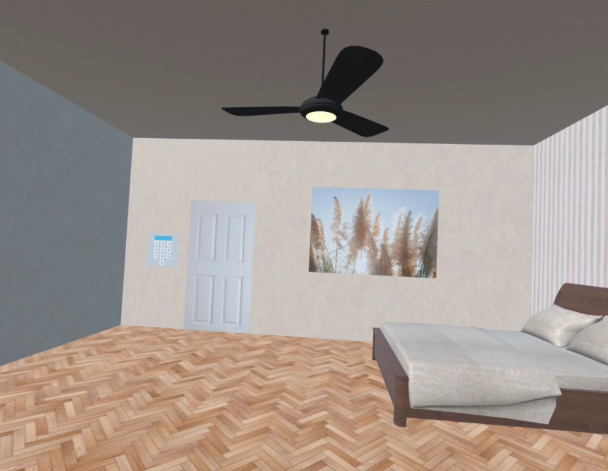
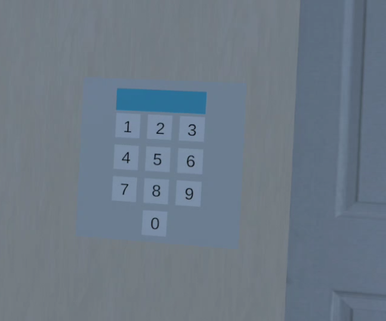
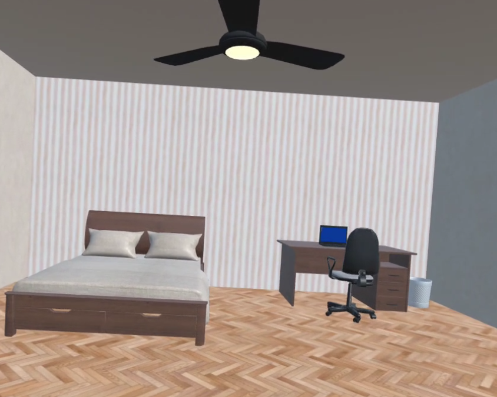
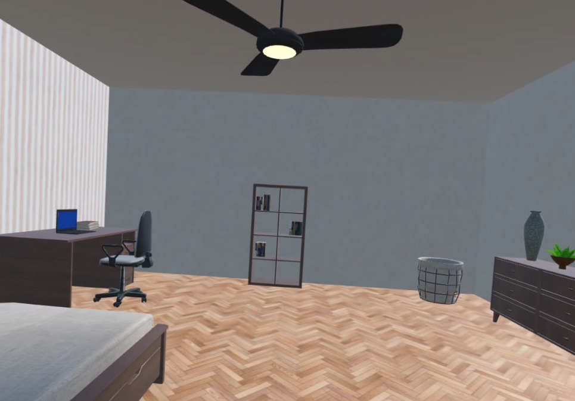
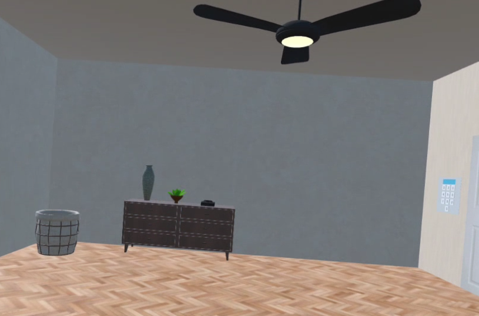
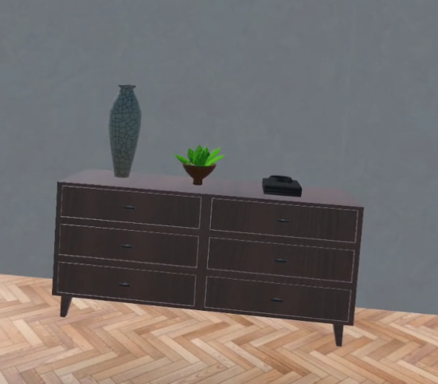

# Escape Room

  

[English below ↓↓↓↓](#the-project)

[En cours de création]

## Le projet

  

Ce projet a pour but de réaliser un escape room en réalité virtuelle à l'aide d'Unity. Pour le moment, le projet contient une seule pièce avec une énigme.

  

## Installation

  

Pour utiliser ce projet, il faut :

- Installer [Unity][hub] ainsi que l'application [Meta Quest Link][meta];

- Cloner ou télécharger le git;

- Ouvrir le projet avec Unity;

- Compilez le projet sur le casque.

  

## Intéraction

  

### Déplacement

  

Pour se déplacer, le joueur peut se téléporter. Pour cela, il peut utiliser le joystick de la manette droite. Une zone de téléportation apparaît (zone grise = téléportation possible, zone rouge = téléportation impossible). Le joueur peut se déplacer dans toute la pièce.

  

### Saisie des objets

  

Pour attraper des objets, le joueur peut :

- soit utiliser le bouton grip de la manette gauche (situé sur le côté de la manette) lorsqu'il est proche de l'objet;

- soit utiliser le laser et le bouton grip de la manette droite (situé sur le côté de la manette) lorsque l'objet n'est pas à sa portée.

Pour ouvrir quelque chose (armoire, tiroir...), le joueur doit utiliser le bouton gâchette (situé sur le devant de la manette) de la manette gauche.
  

Tous les objets ne sont pas saisissables, certains objets font uniquement parti du décor.

  

## Dépendances et paramètres

  

Version d'Unity : [6.0.38f1][unityversion] \

Version de l'XR Interaction Toolkit : 3.0.7 \

Le projet est réalisé et testé avec un Meta Quest 3.

  

## Assets utilisés

  

- Porte : utilisation de [Free Wood Door Pack][porte]

- Poubelle : utilisation de [Trash Bin][poubelle]

- Mobiliers et décoration de la chambre : utilisation de [Big Furniture Pack][chambre1], [Minimalist ArchViz Bedroom][chambre2] et [Apartment Kit][chambre3]

- Ordinateur : utilisation de [PKS_Laptop_low][pc]

- Livres : utilisation de [QA Books][livres]

- Plafonnier : utilisation de [Casual Light Pack][light]

  

## Etape 1 : une seule pièce avec une énigme

  La première pièce de l'escape game est une chambre. Pour sortir de cette chambre, il faut trouver le code qui permet d'ouvrir la porte. 
  

 

Améliorations possibles :
  - Améliorer la lumière pour la rendre plus réaliste

## Etapes suivantes : création d'autres pièces

  

La suite du projet serait de créer d'autres pièces afin d'avoir d'autres énigmes et donc un escape game plus complet.

  

---

## The Project

[In progress] 

The goal of this project is to create a virtual reality escape room using Unity. Currently, the project features a single room with one puzzle.

  

## Installation

To play this project, you need to:

- Install [Unity][hub] and the [Meta Quest Link][meta] app.

- Clone or download this repository to your local machine.

- Open Unity and click "Open".

- Build it to your VR headset.

  

## Interaction

### Teleport

To move around, the player can teleport using the right controller's joystick. A teleportation zone appears (gray zone = teleportation possible, red zone = teleportation not possible). The player can move freely within the room.

  

### Grab

  

To grab objects, the player can:

- Use the grip button on the left controller (located on the side of the controller) when close to the object;

- Use the laser and the grip button on the right controller (located on the side of the controller) when the object is out of reach.

To open something (a cabinet, drawer, etc.), the player must use the trigger button (located on the front of the controller) on the left controller.
  

Not all objects are interactable; some are purely decorative.

  

## Dependencies and Settings

  

Unity Version: [6.0.38f1][unityversion] \

XR Interaction Toolkit Version: 3.0.7 \

The project is developed and tested with a Meta Quest 3.

  
  

## Assets Used

  

- Door: [Free Wood Door Pack][porte]

- Trash Bin: [Trash Bin][poubelle]

- Furniture and room decoration: using [Big Furniture Pack][chambre1], [Minimalist ArchViz Bedroom][chambre2], and [Apartment Kit][chambre3]

- Computer: [PKS_Laptop_low][pc]

- Books: [QA Books][livres]
- Ceiling light: using [Casual Light Pack][light]

  

## Step 1: A Single Room with One Puzzle
The first room of the escape game is a bedroom. To exit this room, you need to find the code that unlocks the door. 

 

Possible improvements:
    
-   Improve lighting to make it more realistic
  

## Next Steps: Creating Additional Rooms

  

The next phase of the project is to develop more rooms with additional puzzles, making the escape game more complete.

  

[unityversion]: <https://unity.com/fr/releases/editor/whats-new/6000.0.38#notes>

[porte]: <https://assetstore.unity.com/packages/3d/props/interior/free-wood-door-pack-280509>

[keypad]: <https://assetstore.unity.com/packages/3d/props/electronics/keypad-free-262151>

[chambre1]: <https://assetstore.unity.com/packages/3d/props/furniture/big-furniture-pack-7717>

[chambre2]: <https://assetstore.unity.com/packages/3d/environments/minimalist-archviz-bedroom-131093>

[poubelle]: <https://assetstore.unity.com/packages/3d/props/furniture/trash-bin-96670>

[livres]: <https://assetstore.unity.com/packages/3d/props/interior/qa-books-115415>

[pc]: <https://assetstore.unity.com/packages/3d/props/pks-laptop-low-264665>

[meta]: <https://www.meta.com/fr-fr/help/quest/1517439565442928/?srsltid=AfmBOopkSjnjqp4WxYa2_saKjVrcXnT893FLHjNIZw3kS3YSjOKN6O2I>

[hub]: <https://unity.com/download>
[chambre3]:<https://assetstore.unity.com/packages/3d/environments/apartment-kit-124055>
[light]:<https://assetstore.unity.com/packages/3d/props/interior/casual-light-pack-303168>
